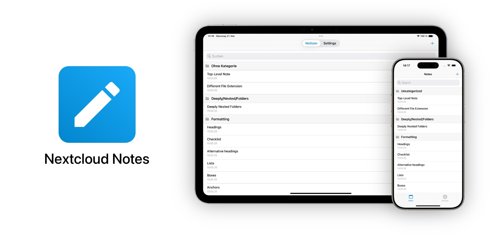

# Nextcloud Notes for iOS and iPad OS

Nextcloud Notes is a native client for the [Nextcloud](https://nextcloud.com "Nextcloud") [Notes](https://apps.nextcloud.com/apps/notes "Notes") app.
It allows you to add, edit, and delete your notes on iPhone and iPad.
Plain Markdown editing and rich text editing is supported.
Notes can be exported to several formats.
Notes can be organized in categories.

## Download on the App Store

You can download Nextcloud Notes directly from the [App Store](https://apps.apple.com/app/nextcloud-notes/id813973264).
Scan the QR code below to download the app from the App Store.

## Development

This repository comes with a convenience script and example data to use during development and testing.
For further information, see [Server/README.md](Server/README.md).

## Testing

We occassionally use [Apple's TestFlight](https://developer.apple.com/testflight/) to make builds available for testing internally or publicly by community members.
You can join public beta testing with the following link but note that not always a build is available.

**[🛫 Join Nextcloud Notes TestFlight](https://testflight.apple.com/join/m7C1rYuN)**

**Disclaimer**: Builds distributed through TestFlight are beta software and may contain bugs or unexpected behavior which may result in data loss.

## License 

See [LICENSE](LICENSE) file.